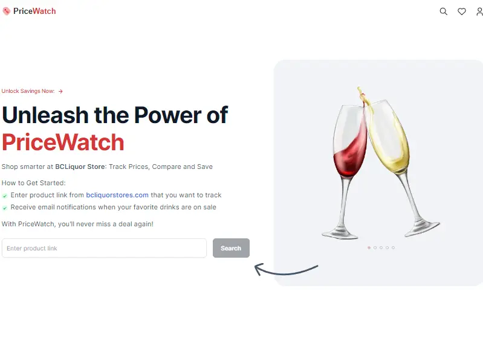
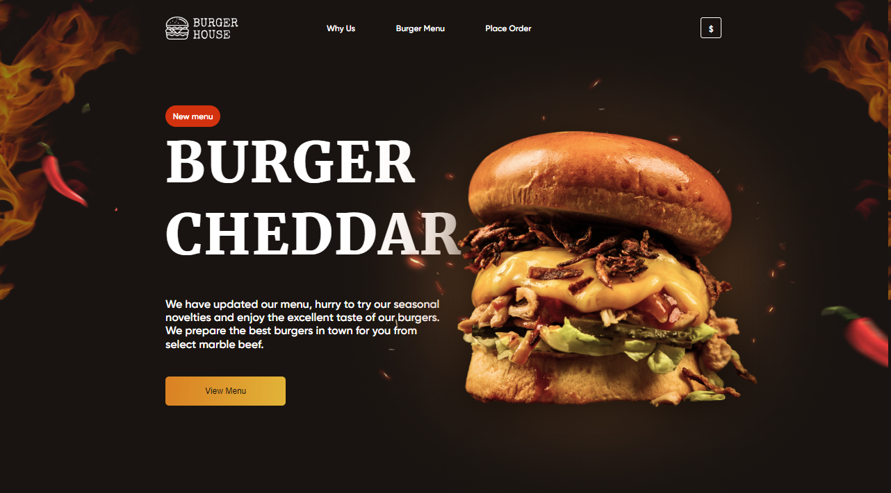
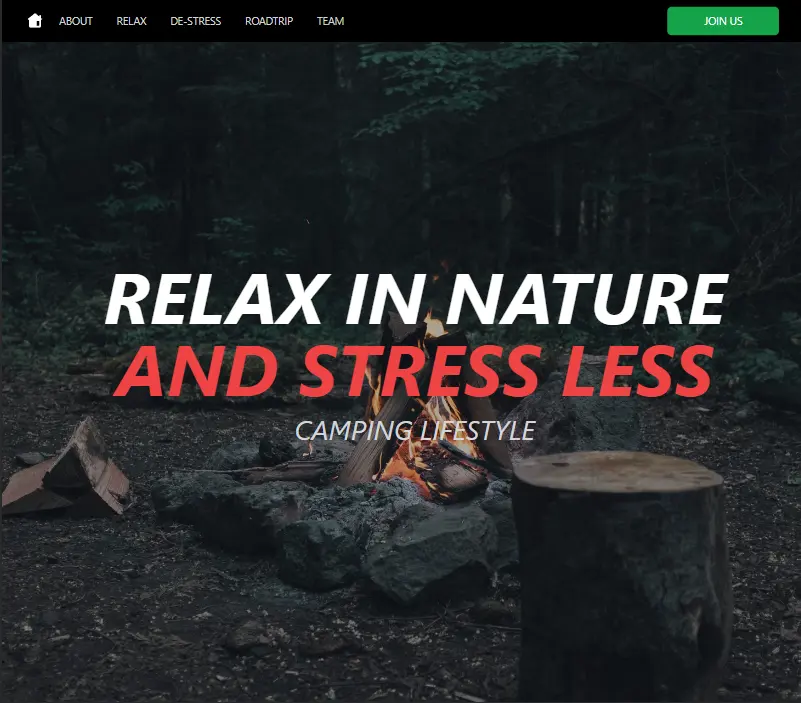
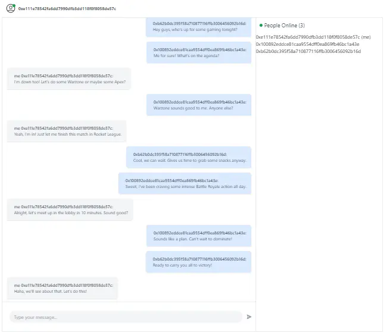
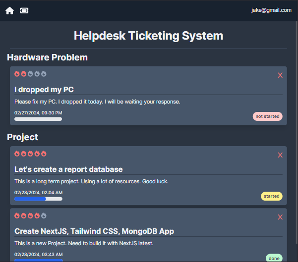
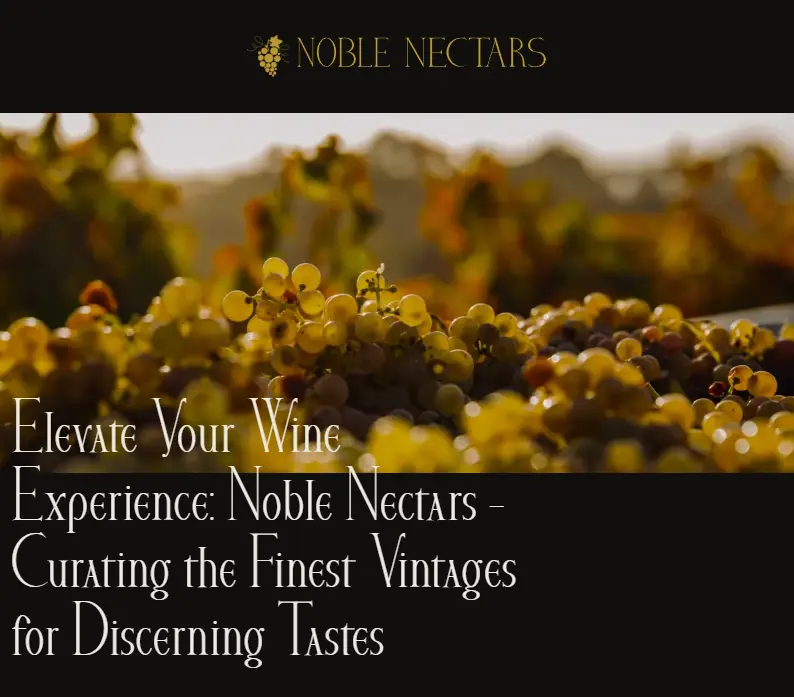
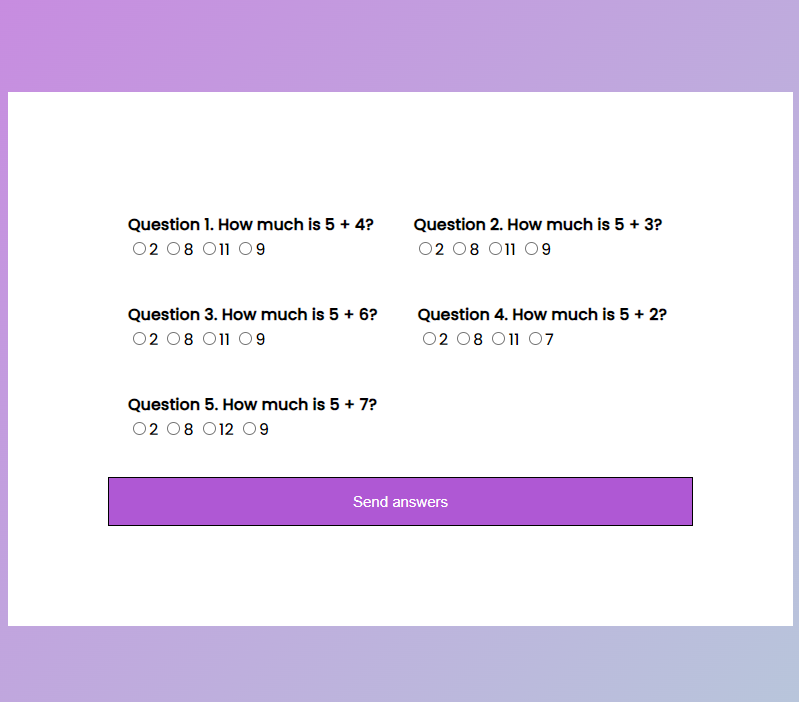
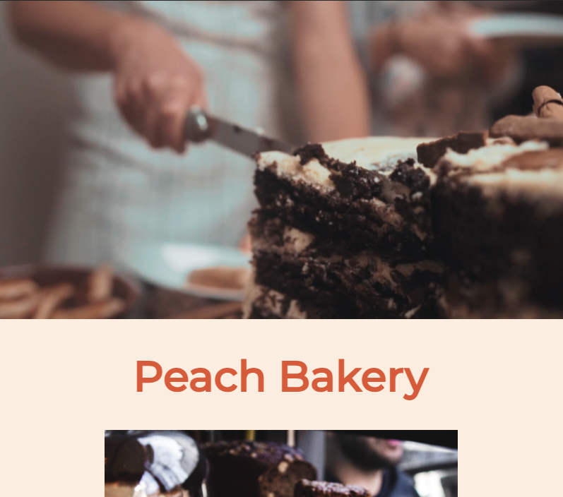
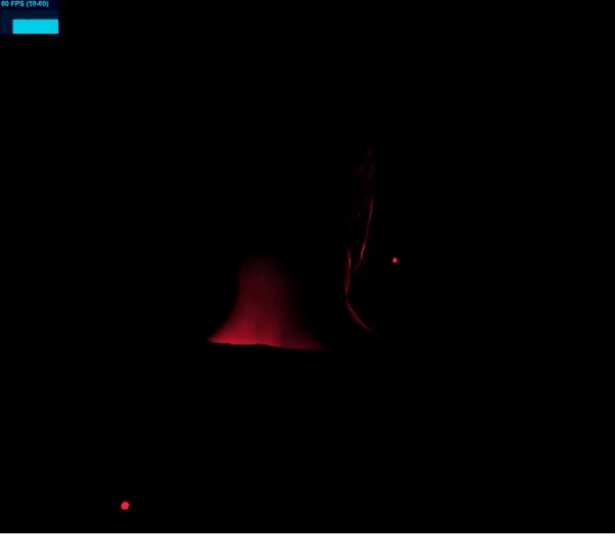

### Hey there 👋 I'm Ekaterina

Passionate Full-Stack Developer who enjoys working on both the front and back ends as well as cloud solutions. Specialize in building dynamic applications with a focus on NextJS, React, NodeJS, server-side rendering, efficient client-server data exchange and cloud-based architecture.

💫 Experienced in dynamic startup environments within the Gaming and Web3 industries.

🧩 Always open to new challenges! I see them as opportunities for growth and innovation.

#
### 🚀 Teck Stack

- **Frontend:** NextJS, ReactJS, JavaScript, Tailwind CSS, 3D animation with GSAP, Framer Motion, React-three-fiber, ThreeJS
- **Backend & Automation:** NodeJS, Socket.IO, REST APIs, Docker, Linux/WSL, Nunjucks, Tauri, GitHub Actions, Cron
- **Hosting & Deployment:** AWS Amplify, Vercel, Netlify, GitHub Pages, Heroku
- **Cloud Services:** AWS (EC2, LB, SSM, ECR, IAM, Route53, S3, Cognito (Auth/OAuth), DynamoDB, Lambda)
- **Blockchain Development:** EthersJS, Ethereum, NFT, OpenSea API, Infura, Polygon/Amoy, IPFS, Pinata, Hardhat, Truffle, Solidity Smart Contracts, Remix, Etherscan
- **Game Development:** Unreal Engine 5, UE Blueprint Scripting, UE Pixel Streaming, Dedicated Game Servers, Inno Setup scripting (for distributing games)
- **Technologies**: Git/Git LFS/GitHub, Figma, Ably, Stripe, Tailscale, Jira, Confluence

🌱 Exploring TypeScript and React Native to strengthen capabilities in full-stack development.

 

#
### ⚒️ My Creations

<table cellpadding="0">
  <tr style="padding: 0">
    <td valign="top">
      
Web Scraping App

      
NextJS 14, MongoDB, Bright Data

      
    </td>
    <td valign="top">
      
Burger House App

      
Angular, TypeScript, CSS, Netlify

      
    </td>
    <td valign="top">
      
Camplifestyle App

      
React, GSAP, Tailwind CSS, Netlify

      
    </td>
  </tr>
  <tr style="padding: 0">
    <td valign="top">
      
Chat with Metamask

      
NextJS, Ethers.js, Vercel

      
    </td>
    <td valign="top">
      
Ticketing System App

      
NextJS, Tailwind CSS, MongoDB

      
    </td>
        <td valign="top">
      
Winery Nectars App

      
JavaScript, Sass, Gulp, Netlify

      
    </td>
  </tr>
  <tr style="padding: 0">    
<!--     <td valign="top">
      
Quiz App

      
HTML, CSS, JS, Glitch

            
    </td> -->
    <td valign="top">
      
Lawyers Office App

      
HTML, CSS, Netlify

      
    </td>
    <td valign="top">
      
Peach Bakery App

      
HTML, GSAP, CSS, Netlify

      
    </td>
    <td valign="top">
      
3D Animated Model

      
ThreeJS, Netlify

      
    </td>
  </tr>
</table>

<!--
**EkaterinaGorbunova/ekaterinagorbunova** is a ✨ _special_ ✨ repository because its `README.md` (this file) appears on your GitHub profile.

Here are some ideas to get you started:

- 🔭 I’m currently working on ...
- 🌱 I’m currently learning ...
- 👯 I’m looking to collaborate on ...
- 🤔 I’m looking for help with ...
- 💬 Ask me about ...
- 📫 How to reach me: ...
- 😄 Pronouns: ...
- ⚡ Fun fact: ...
-->
