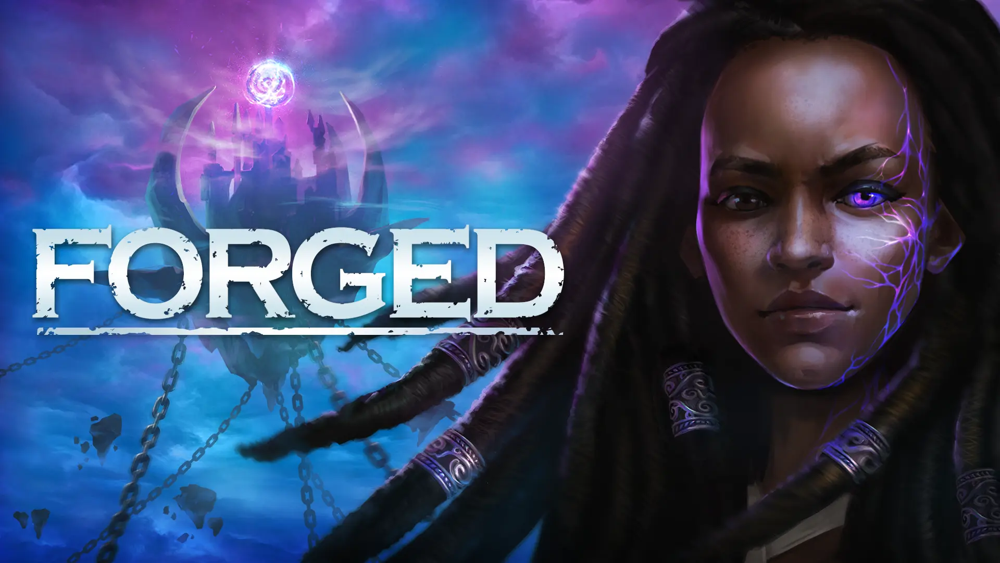
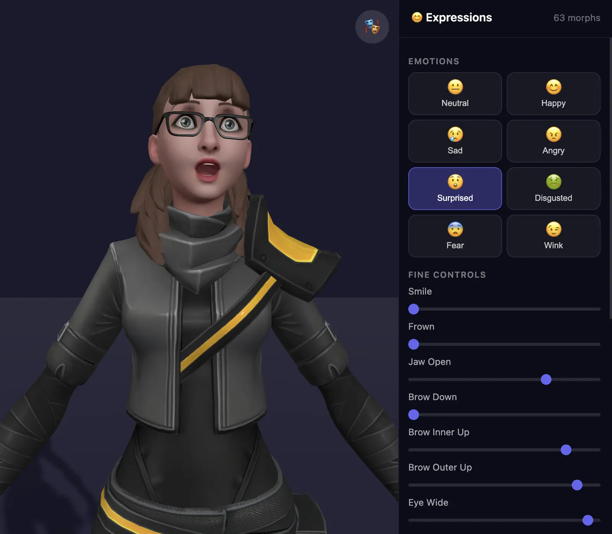
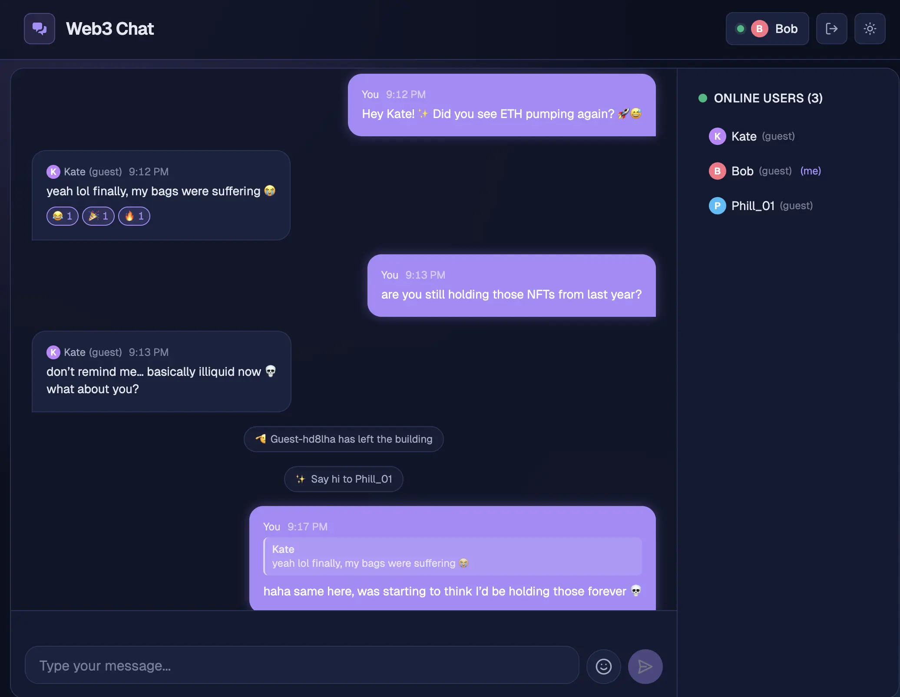
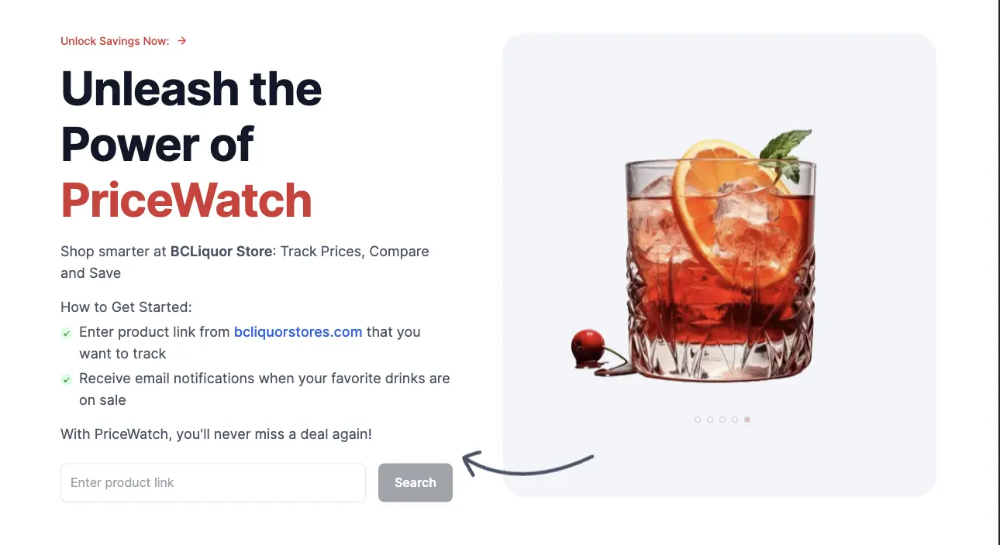
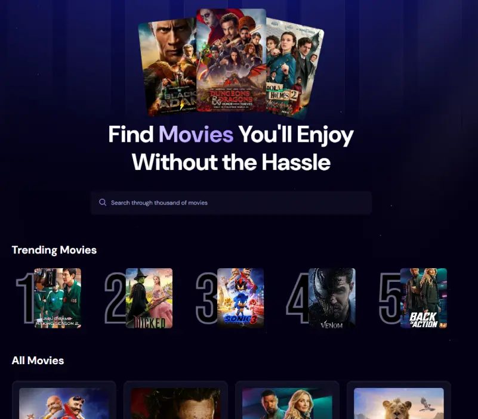
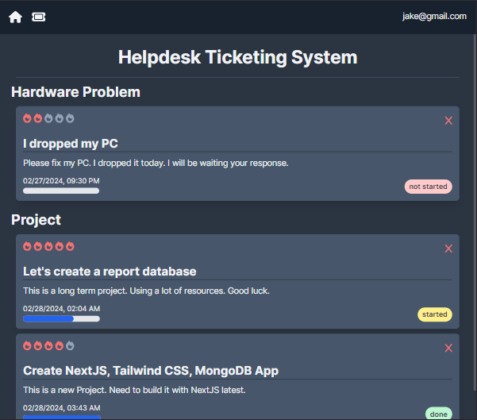
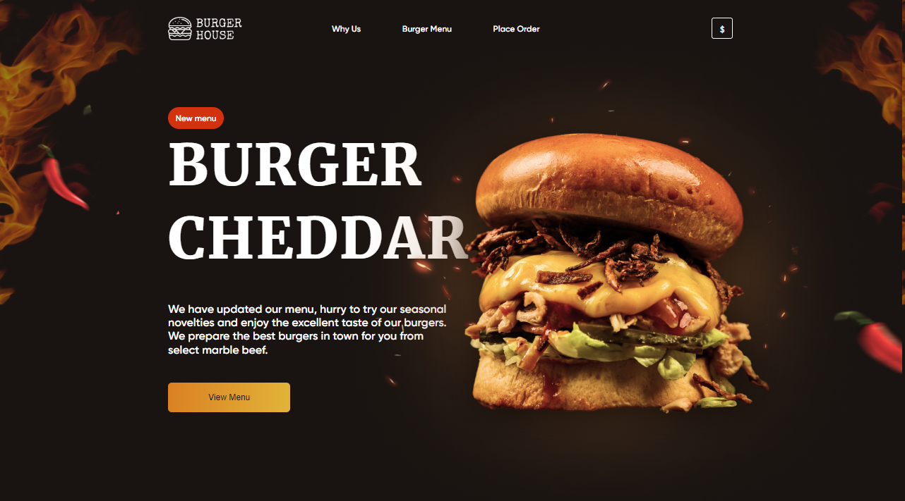

<!-- 
**Frontend**

**Backend**

**QA & Testing**

**Cloud & CI/CD**

**Game & Graphics**

-->

#

### Hey there 👋 I'm Ekaterina

<!--  -->

Full-Stack Software Engineer based in Vancouver, with 5+ years of experience building web/web3 platforms, real-time game infrastructure and test automation frameworks.

I work across the whole stack with Next.js/React, Node.js, TypeScript and AWS. I'm equally comfortable shipping production features, building QA frameworks from scratch and owning cloud infrastructure end-to-end.

#

### 🚀 What I've shipped

**Web Development**
- Web platform for a multiplayer VR game: auth, in-game economy, battle history dashboard ([Forged](https://dev.forged.net/))
- Real-time chat with wallet authentication, ENS lookup and ETH tipping ([live demo](https://real-time-web3-chat.vercel.app/))
- E-commerce platform with product catalog, cart, checkout and webhook-based order processing ([live demo](https://eclair-marketplace.vercel.app/))
- Price tracking tool with scheduled data collection and historical analysis ([live demo](https://pricewatcher-bcliquor.vercel.app/))

**QA & Test Automation**
- Built a full GraphQL Web3 API validation framework from scratch: schema diffing, breaking-change detection, data-integrity checks across 6+ EVM networks, 100% root Query field coverage
- Wrote 80+ automated test cases (sanity, smoke, regression, E2E) in Playwright, Jest and Postman, executing 300+ data-integrity assertions against on-chain sources (Etherscan, RPC nodes)
- Automated the full test lifecycle via GitHub Actions: scheduled runs, Slack alerts, auto-published reports
- Shipped an internal Next.js dashboard showing API coverage and data gaps, adopted by cross-functional teams as the release-readiness gate

**Game Tech**
- Real-time matchmaking and session-sync backend handling 100+ concurrent players for a multiplayer VR game
- In-browser cloud gaming via UE5 Pixel Streaming on Dockerized EC2, removing multi-GB client downloads
- 3D NFT avatar system with 63 ARKit blend shapes and real-time facial animation in the browser ([live demo](https://avatar-expressions.vercel.app/))
- Full-stack NFT dApp shipped in 2 weeks (3-person team): smart contracts, IPFS storage, 100+ daily mints

#

### 📈 Impact

- Cut API validation from hours to minutes with scheduled GitHub Actions, Slack alerts and auto-published reports
- Dropped Largest Contentful Paint from ~4s to under 1s with Next.js SSR and caching, improving onboarding
- Reduced monthly AWS costs by ~40% through autoscaling and idle-instance shutdown for UE5 dedicated servers
- Cut incident resolution from 15+ min to 2 min via internal ops dashboard with one-click EC2 controls
- Achieved 100% root Query field coverage on a GraphQL API that previously had zero automated testing

# 

### 🛠 Tech I work with

**Frontend:** `TypeScript` `React` `Next.js` `Tailwind` `Framer Motion`

**Backend:** `Node.js` `Express` `REST` `GraphQL` `MongoDB` `PostgreSQL` `Docker`

**QA & Testing:** `Playwright` `Jest` `Postman` `Slack integrations` `Test Reporting Pipelines`

**Cloud & CI/CD:** `AWS (EC2, Lambda, DynamoDB, Cognito, S3)` `GitHub Actions` `Vercel`

**Game & Graphics:** `Three.js` `WebGL` `UE5` `Pixel Streaming` `Socket.IO`

#

### 📊 GitHub Stats

  
  

#

### ⚒️ Projects

<table cellpadding="0">
  <tr>
    <td valign="top" width="33%">
      
<strong>Multiplayer VR Game Platform</strong>

      
Next.js, Node, Socket, AWS

      

        <a href="https://store.steampowered.com/app/1125920/Forged/">Steam</a>
      

      
    </td>
    <td valign="top" width="33%">
      
<strong>3D Avatar Generator</strong>

      
Three.js, WebGL, Morph Targets

      
    </td>
      <td valign="top" width="33%">
      
<strong>Real-Time Chat with Web3 Wallet</strong>

      
Next.js, Ethers.js, Vercel

      
    </td>
  </tr>
  <tr>
    <td valign="top" width="33%">
      
<strong>Web Scraping</strong>

      
Next.js, MongoDB, Bright Data

      
    </td>
    <td valign="top" width="33%">
      
<strong>E-commerce Platform</strong>

      
Next.js, PostgreSQL, Stripe

      
    </td>
    <td valign="top" width="33%">
      
<strong>Search Movie App</strong>

      
React, Tailwind CSS, Vercel

      
    </td>
  </tr>
  <tr>
    <td valign="top" width="33%">
      
<strong>Ticketing System App</strong>

      
Next.js, Tailwind CSS, MongoDB

      
    </td>
    <td valign="top" width="33%">
      
<strong>Burger House App</strong>

      
Angular, TypeScript, Stripe, Netlify

      
    </td>
    <td valign="top" width="33%">
      
<strong>Winery Nectars App</strong>

      
JavaScript, Sass, Gulp, Netlify

      
    </td>
  </tr>
</table>

### 🤝 How I work

I've spent most of my career in small teams. I'm used to being the first or only engineer on a domain.

A few things I've learned the hard way:

- **The boring parts are the load-bearing ones.** Retries, timeouts,
  idempotency, alerting - that's what keeps a system standing on a
  bad Tuesday. I treat them as features, not chores.
- **"Done" means it works in production, not on my machine.** I'm not
  done when the PR merges. I'm done when I've watched it survive real
  traffic and the dashboards stay green.
- **Cost is a design constraint.** Cloud bills, build times, on-call
  noise - they all compound. I try to make choices that don't quietly
  bleed the team.
- **Speed comes from clarity, not from skipping steps.** A 10-minute
  conversation up front saves a 3-day rewrite. I ask early, scope
  small, and ship in slices.
- **I write for the next person.** The next person is usually me, six
  months later, with no memory of why I did it that way.

### 📬 Let's talk

I’m always happy to talk about real-time systems, web platforms, game infrastructure, and Web3, or just trade notes on shipping software in small, fast-moving teams.

I’m open to full-stack roles, contract work and both 0 → 1 builds and re-architecture efforts.

Especially interested in:
- modern web architecture  
- real-time systems  
- system design & re-architecture  
- game tech  
- Web3 infrastructure  

💼 **LinkedIn:** [linkedin.com/in/egorbunova](https://linkedin.com/in/egorbunova)

🌐 **GitHub:** you're already here 👋

Thanks for reading this far.

#

  Built with care in Vancouver 🇨🇦

