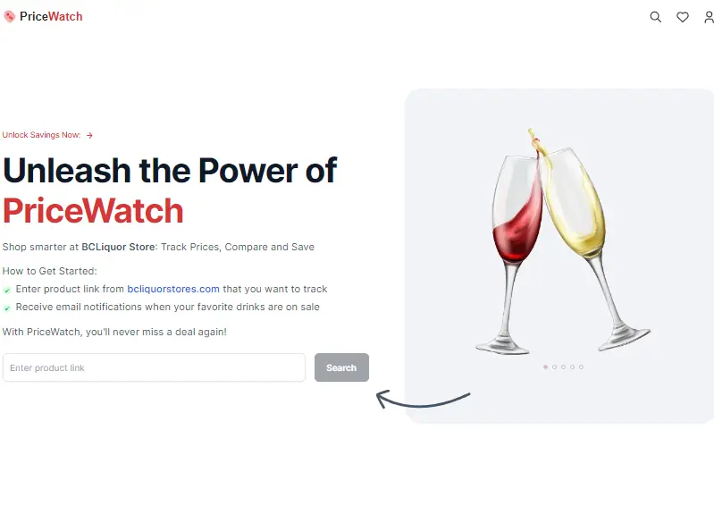
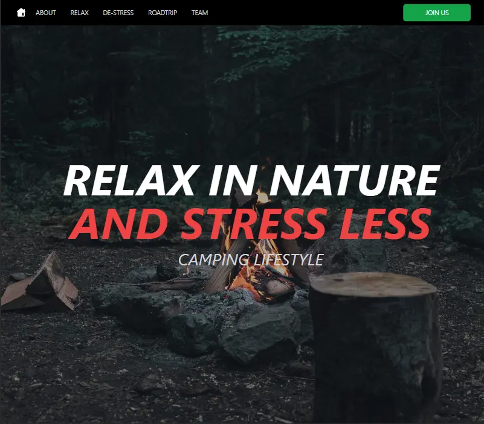
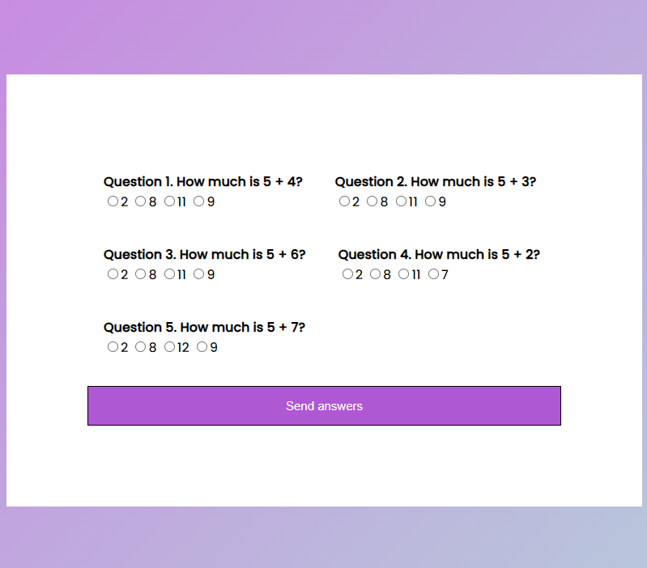
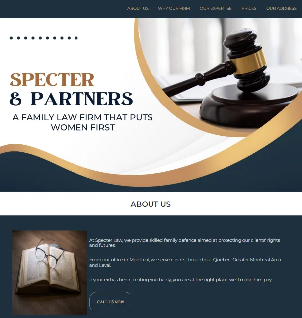
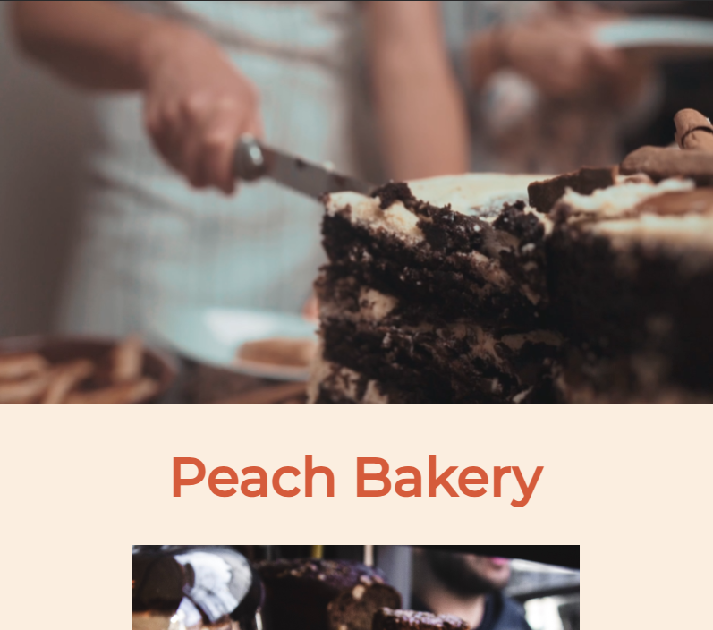
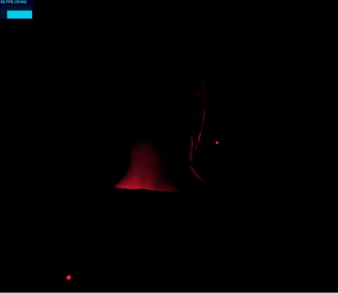

### Hey there 👋 I'm Ekaterina
Full-Stack Software Engineer based in Vancouver, Canada, with 5+ years of experience building web/web3 platforms, real-time game infrastructure and test automation frameworks.

I work across the whole stack with **Next.js/React**, **Node.js**, **TypeScript** and **AWS**. I'm equally comfortable shipping production features, building QA frameworks from scratch and owning cloud infrastructure end-to-end.

#### 🚀 What I've shipped

**Web Development**
- E-commerce platform with product catalog, cart, checkout, and webhook-based order processing ([live demo](eclair-marketplace.vercel.app))
- Price tracking tool with scheduled data collection and historical analysis ([live demo](https://pricewatcher-bcliquor.vercel.app/))
- Web platform for a multiplayer VR game: auth, in-game economy, battle history dashboard ([Forged](https://dev.forged.net/))
- Real-time chat with wallet authentication, ENS lookup and ETH tipping ([live demo](https://real-time-web3-chat.vercel.app/))

**QA & Test Automation**
- Built a full GraphQL Web3 API validation framework from scratch: schema diffing, breaking-change detection, data-integrity checks across 6+ EVM networks, 100% root Query field coverage
- Wrote 80+ automated test cases (sanity, smoke, regression, E2E) in Playwright, Jest, and Postman, executing 300+ data-integrity assertions against on-chain sources (Etherscan, RPC nodes)
- Automated the full test lifecycle via GitHub Actions: scheduled runs, Slack alerts, auto-published reports
- Shipped an internal Next.js dashboard showing API coverage and data gaps, adopted by cross-functional teams as the release-readiness gate

**Game Tech**
- Real-time matchmaking and session-sync backend handling 100+ concurrent players for a multiplayer VR game
- In-browser cloud gaming via UE5 Pixel Streaming on Dockerized EC2, removing multi-GB client downloads
- 3D NFT avatar system with 63 ARKit blend shapes and real-time facial animation in the browser ([live demo](https://avatar-expressions.vercel.app/))
- Full-stack NFT dApp shipped in 2 weeks (3-person team): smart contracts, IPFS storage, 100+ daily mints

#### 📈 Impact

- Cut **API validation from hours to minutes** with scheduled GitHub Actions, Slack alerts, and auto-published reports
- Dropped **Largest Contentful Paint from ~4s to under 1s** with Next.js SSR and caching, improving onboarding
- Reduced **monthly AWS costs by ~40%** through autoscaling and idle-instance shutdown for UE5 dedicated servers
- Cut **incident resolution from 15+ min to 2 min** via internal ops dashboard with one-click EC2 controls
- Achieved **100% root Query field coverage** on a GraphQL API that previously had zero automated testing

#### 🛠 Tech I work with

**Frontend:** `TypeScript` `React` `Next.js` `Tailwind` `Framer Motion`

**Backend:** `Node.js` `Express` `REST` `GraphQL` `MongoDB` `PostgreSQL` `Docker`

**QA & Testing:** `Playwright` `Jest` `Postman` `Slack integrations` `Test Reporting Pipelines`

**Cloud & CI/CD:** `AWS (EC2, Lambda, DynamoDB, Cognito, S3)` `GitHub Actions` `Vercel`

**Game & Graphics:** `Three.js` `WebGL` `UE5` `Pixel Streaming` `Socket.IO`

 

<!--   -->

#
### ⚒️ Projects

<table cellpadding="0">
  <tr style="padding: 0">
    <td valign="top">
      
Web Scraping App

      
NextJS 14, MongoDB, Bright Data

      
    </td>
    <td valign="top">
      
Burger House App

      
Angular, TypeScript, Stripe, Netlify

      
    </td>
    <td valign="top">
      
Search Movie App

      
React, Tailwind CSS, Vercel

      
    </td>
<!--     <td valign="top">
      
Camplifestyle App

      
React, GSAP, Tailwind CSS, Netlify

      
    </td> -->
  </tr>
  <tr style="padding: 0">
    <td valign="top">
      
Real-Time Chat with Crypto Wallet

      
NextJS, Ethers.js, Vercel

      
    </td>
    <td valign="top">
      
Ticketing System App

      
NextJS, Tailwind CSS, MongoDB

      
    </td>
        <td valign="top">
      
Winery Nectars App

      
JavaScript, Sass, Gulp, Netlify

      
    </td>
  </tr>
  <tr style="padding: 0">    
<!--     <td valign="top">
      
Quiz App

      
HTML, CSS, JS, Glitch

            
    </td> -->
<!--     <td valign="top">
      
Lawyers Office App

      
HTML, CSS, Netlify

      
    </td> -->
<!--     <td valign="top">
      
Peach Bakery App

      
HTML, GSAP, CSS, Netlify

      
    </td> -->
<!--     <td valign="top">
      
3D Animated Model

      
ThreeJS, Netlify

      
    </td> -->
  </tr>
</table>

<!--
**EkaterinaGorbunova/ekaterinagorbunova** is a ✨ _special_ ✨ repository because its `README.md` (this file) appears on your GitHub profile.

Here are some ideas to get you started:

- 🔭 I’m currently working on ...
- 🌱 I’m currently learning ...
- 👯 I’m looking to collaborate on ...
- 🤔 I’m looking for help with ...
- 💬 Ask me about ...
- 📫 How to reach me: ...
- 😄 Pronouns: ...
- ⚡ Fun fact: ...
-->
