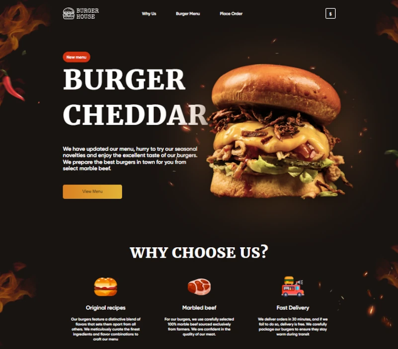
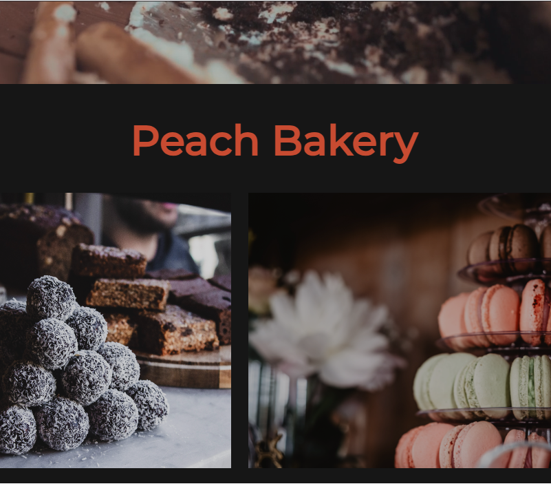
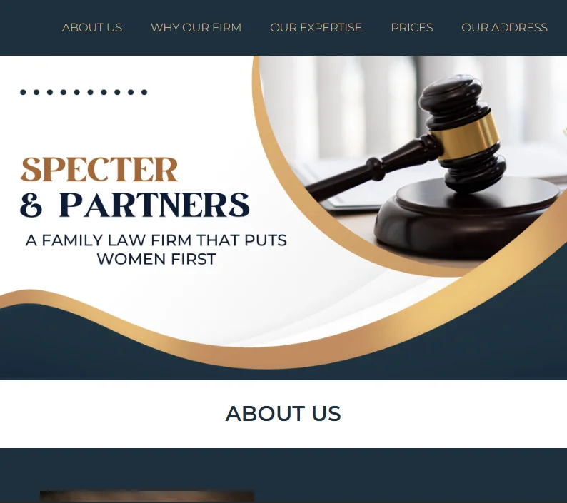

### Hi there 👋, I'm Kate
I'm a Full Stack Software Developer who enjoys working on both the front and back ends as well as cloud solutions. Specialize in building dynamic cloud-based applications with a focus on NextJS and client-server communication.

#
### 🚀 Languages and Tools

- **Frontend Development:** NextJS, React, JavaScript, Tailwind CSS
- **Backend Development and Automation:** NodeJS, Socket.IO, REST APIs, Docker, Nunjucks, GitHub Actions, Cron
- **Hosting and Deployment:** Vercel, Amplify, Netlify, Heroku
- **Cloud Services:** AWS (EC2, LB, SSM, ECR, IAM, Route53, S3, Cognito (Auth/OAuth), DynamoDB, Lambda)
- **Blockchain:** Web3, ether.js, Ethereum, NFT, OpenSea, Infura, Polygon, IPFS, Pinata, Hardhat, Truffle, Solidity, Smart Contracts, Remix, Etherscan
- **Backend Game Development:** Unreal Engine, Blueprint Visual Scripting, Pixel Streaming, Dedicated Game Servers, Inno Setup scripting (for distributing games)

🌱 I’m currently exploring TypeScript and React Native to strengthen capabilities in full-stack development.

#
### ⚒️ My Creations

<table cellpadding="0">
  <tr style="padding: 0">
    <td valign="top">
      
Burger House App

      
Angular, TypeScript, CSS, Netlify

      
    </td>
    <td valign="top">
      
Camplifestyle App

      
React, GSAP, Tailwind CSS, Netlify

      
    </td>
    <td valign="top">
      
Winery Nectars App

      
JavaScript, Sass, Gulp, Netlify

      
    </td>
  </tr>
  <tr style="padding: 0">    
    <td valign="top">
      
Peach Bakery App

      
HTML, GSAP, CSS, Netlify

      
    </td>
<!--     <td valign="top">
      
Quiz App

      
HTML, CSS, JS, Glitch

            
    </td> -->
    <td valign="top">
      
Lawyers Office App

      
HTML, CSS, Netlify

      
    </td>
    <td valign="top">
      
3D Animated Model

      
ThreeJS, Netlify

      
    </td>
  </tr>
</table>

##

<!--
**EkaterinaGorbunova/ekaterinagorbunova** is a ✨ _special_ ✨ repository because its `README.md` (this file) appears on your GitHub profile.

Here are some ideas to get you started:

- 🔭 I’m currently working on ...
- 🌱 I’m currently learning ...
- 👯 I’m looking to collaborate on ...
- 🤔 I’m looking for help with ...
- 💬 Ask me about ...
- 📫 How to reach me: ...
- 😄 Pronouns: ...
- ⚡ Fun fact: ...
-->
